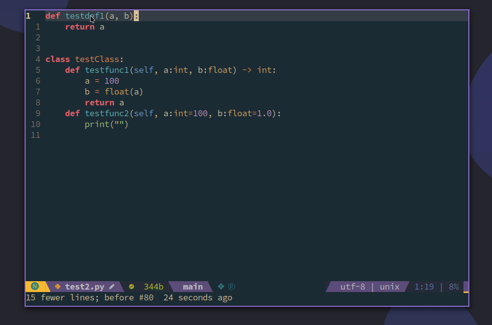
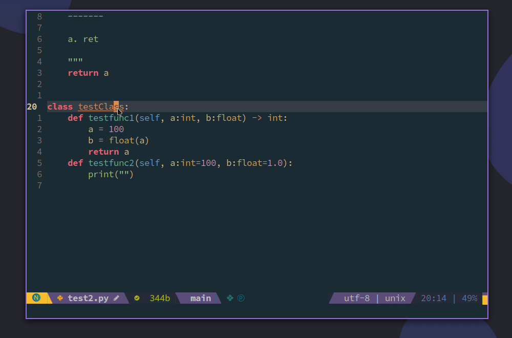

# pycomment

 

ENGLISH  |  [中文版](./README_cn.md)

## Show




## Introduction

Automatic generate docstring including inputed parameters, returned variable , and their type.

## Install

- [x] vim-plug
```vim
Plug 'demonlord1997/pycomment', {'for','python'}
```
- [x] dein
```vim
[[plugins]]
repo = 'demonlord1997/pycomment'
on_ft = 'python'
```
## Setting

If you want to use default setting, you can write following contents in your configure.
```vim
let g:pycomment_mark_mapping = 1
```
In this case, pressing `Ctrl+c` in the function definition or the function body will expand docstring. Press `<leader> + <leader>` will replace `<++>` but you will not enter insert mode.

```vim
let g:pycomment_mark_mapping = 0
nmap <C-c> <nop>
nmap <silent> <C-c> <Plug>(pycomment)
nmap <leader><leader> <ESC>/<++><CR>:nohlsearch<CR>c4l
```
Press `Ctrl+c` will expand docstring.

Press `<leader> + <leader>` will replace `<++>` and enter insert mode.
